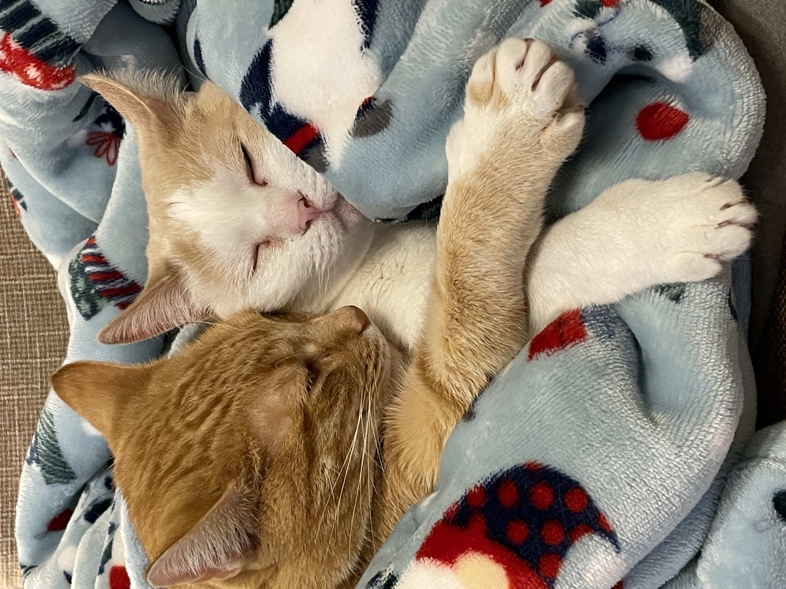

# About Me
Hi, my name is Kelly Hong. I'm an undergraduate (Class of 2026) majoring in 6-3 and minoring in Japanese. My goals this semester are to learn useful skills for the future and to maintain an okay sleep schedule. Here's my [LinkedIn](https://www.linkedin.com/in/kellyhong612) if you'd like to connect!

Some fun facts about me:
1. I *really* like mangos.
2. I have two cats, Bubba and Ella.
3. I find honey bitter??

# Table of Contents
* [Link to Assignment 1](assignments/assignment1.md)
* [Link to PSet1](assignments/pset1.md)
* [Link to PSet2](assignments/pset2.md)
* [Link to Assignment 2](assignments/assignment2.md)